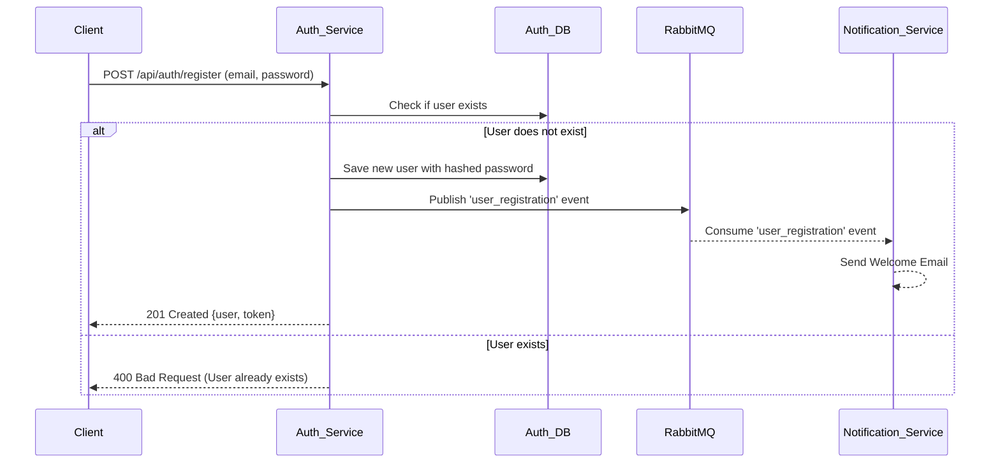
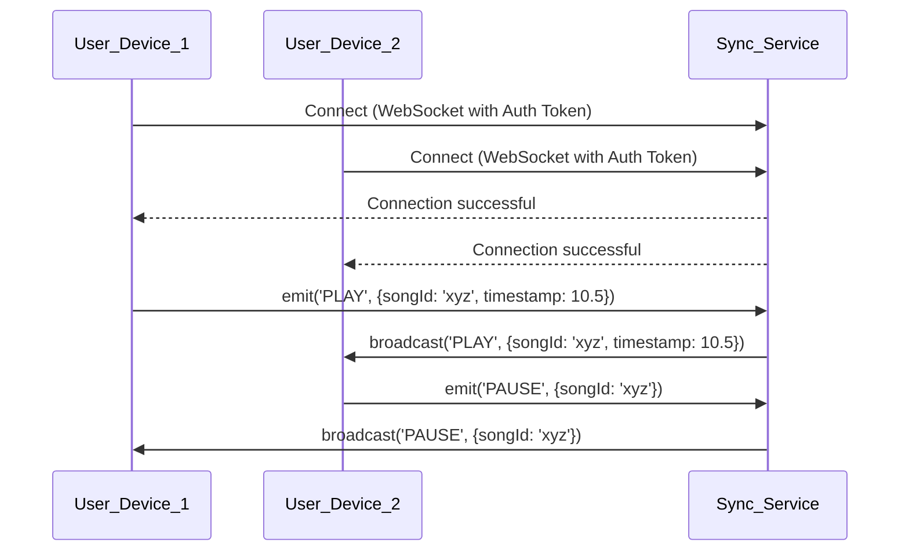

# 🚀 Sangeet: Your Next-Gen Microservices Music Streaming Platform 🚀

Welcome to **Sangeet**! This project is a deep dive into building a scalable, resilient, and feature-rich music streaming platform using a microservices architecture, just like Spotify. We're crafting a digital audio experience where every component works harmoniously yet independently, ensuring a robust and dynamic user experience.

## ✨ The Sangeet Vision: Why Microservices?

Imagine a music platform that can grow to millions of users, where new features like podcasting or live audio can be added without disrupting existing ones, and where a hiccup in one area (like recommendations) doesn't bring down the entire service. That's the power of microservices, and that's the vision for Sangeet!

We're breaking down the traditional monolithic application into smaller, manageable, and independently deployable services. This approach brings a plethora of benefits:

-   **Scalability:** Each service (auth, music, sync) can be scaled independently based on its demand.
-   **Resilience:** A failure in one service won't cascade and affect the entire application.
-   **Agility:** Faster development cycles and easier deployment of new features.
-   **Technology Diversity:** Freedom to choose the best technology stack for each service.

## 🗺️ Architectural Blueprint: How It All Connects

Sangeet is designed as a constellation of specialized services, each handling a distinct domain of the music streaming ecosystem.

-   **Asynchronous Communication with RabbitMQ:** To ensure seamless and fault-tolerant communication, we use **RabbitMQ** as a message broker. This acts as the central nervous system, allowing services to communicate asynchronously. For example, when a user registers, the `Auth Service` publishes a `USER_CREATED` event, and the `Notification Service` consumes this event to send a welcome email, all without the services being directly dependent on each other.

-   **AWS Cloud Hosting:** Each microservice is designed to find its home on **Amazon Web Services (AWS)**. We envision deploying these services independently on **Amazon ECS (Elastic Container Service)**, leveraging AWS's robust infrastructure for high availability and scalability. Music files will be stored in **AWS S3** for durable, scalable, and fast access.

## 🐳 Containerization with Docker

Each microservice in the Sangeet platform is containerized using Docker. This ensures that each service has a consistent and isolated environment, making it easy to develop, test, and deploy the services independently. The `dockerfile` for each service is based on the `node:18-alpine` image and follows a standard pattern to ensure consistency.

## 🚀 Getting Started: Join the Sangeet Journey!

Ready to dive into the code? Head over to the [Local Development](#-local-development) section to get Sangeet up and running on your local machine.

## 🏡 Local Development

Follow these steps to get Sangeet up and running on your local machine:

1.  **Clone the repository:**
    ```bash
    git clone https://github.com/your-username/sangeet.git
    ```
2.  **Set up environment variables:**
    Each service requires its own set of environment variables to run correctly. Navigate to each service's directory (`auth`, `notification`), create a `.env` file in each, and add the necessary variables. Refer to the [Environment Variables](#-environment-variables) section for a complete list.

3.  **Install dependencies and run the services:**
    For each service you want to run:
    ```bash
    cd sangeet/<service-name>  # e.g., cd sangeet/auth
    npm install
    npm run dev
    ```
    You will need to run each service in a separate terminal window.

## 🔑 Environment Variables

Each service requires a `.env` file in its root directory with the following environment variables:

### Auth Service (`/auth/.env`)
-   `MONGO_URI`: The connection string for your MongoDB database.
-   `JWT_SECRET`: A secret key for signing JWT tokens.
-   `RABBITMQ_URI`: The connection string for your RabbitMQ instance.
-   `CLIENT_ID`: Google OAuth 2.0 Client ID.
-   `CLIENT_SECRET`: Google OAuth 2.0 Client Secret.

### Notification Service (`/notification/.env`)
-   `RABBITMQ_URI`: The connection string for your RabbitMQ instance.
-   `EMAIL_USER`: Your email address for sending notifications.
-   `CLIENT_ID`: Google OAuth 2.0 Client ID for Nodemailer.
-   `CLIENT_SECRET`: Google OAuth 2.0 Client Secret for Nodemailer.
-   `REFRESH_TOKEN`: Google OAuth 2.0 Refresh Token for Nodemailer.
-   `MONGO_URI`: (If needed for templates or logging) The connection string for your MongoDB database.

## ☁️ AWS Deployment

**Disclaimer:** The original AWS deployment for this project has been shut down due to the high costs associated with maintaining the infrastructure. The following is a general guide on how you can deploy the Sangeet services to your own AWS account.

The containerized nature of the Sangeet services makes them ideal for deployment to AWS. Here's a general guide to deploying the services using Amazon ECS:

1.  **Prerequisites:**
    -   An AWS account.
    -   AWS CLI installed and configured on your local machine.
    -   Docker installed on your local machine.

2.  **Create an ECR Repository for Each Service:**
    For each microservice (`auth`, `notification`, etc.), create a new private repository in Amazon Elastic Container Registry (ECR).

3.  **Build and Push Docker Images:**
    For each service, navigate to its directory, build its Docker image, and push it to its ECR repository.

4.  **Set up an ECS Cluster:**
    Create a new ECS cluster to run your containers. The Fargate (serverless) launch type is recommended for ease of use.

5.  **Create Task Definitions:**
    For each service, create a new task definition in ECS. In the task definition, you will specify the ECR image, CPU/memory resources, port mappings, and **define the environment variables** required for the service to run. Use AWS Secrets Manager for sensitive values.

6.  **Create Services:**
    For each task definition, create a new service in your ECS cluster. This will manage running the tasks and handle auto-scaling and resilience.

7.  **Set up an Application Load Balancer (ALB):**
    Create an ALB to route incoming traffic to your services. Configure listener rules to route traffic based on the path (e.g., `/api/auth/*` goes to the auth service).

8.  **Set up S3 for Music Storage:**
    Create an S3 bucket to store music files. Ensure the Music Service has the correct IAM permissions to upload to this bucket and that files are configured for public read access if they are to be streamed directly to clients.

## 📊 Architecture and Flow Diagrams

### High-Level Architecture

```mermaid
graph TD
    subgraph "User Interaction"
        A[Client Browser/App] --> B(API Gateway / ALB);
    end

    subgraph "Core Services"
        B --> C[Auth Service];
        B --> D[Music Service];
        B --> E[Sync Service (WebSocket)];
    end

    subgraph "Supporting Services"
        O[Notification Service];
    end

    subgraph "Data & Events"
        subgraph Databases
            DB1[(Auth DB)]
            DB2[(Music DB)]
        end
        
        subgraph "Message Broker"
            N[RabbitMQ];
        end

        subgraph "File Storage"
            S3[AWS S3];
        end
    end

    %% Service to DB Connections
    C --- DB1;
    D --- DB2;

    %% HTTP Communications
    D --> S3;

    %% Event Publishing
    C -- "USER_CREATED" --> N;
    D -- "NEW_SONG_UPLOADED" --> N;

    %% Event Consumption
    N -- "USER_CREATED" --> O;
    N -- "NEW_SONG_UPLOADED" --> O;
```

### User Authentication Flow



### Real-time Music Sync Flow



## 🌟 Current Services Spotlight

### 🔐 Auth Service

-   **Port:** `3000` (example)
-   **Description:** The gatekeeper of Sangeet. This service handles user registration (including Google OAuth), and authentication. It issues JWTs that are sent as `httpOnly` cookies to secure the platform. Upon registration, it publishes a `user_registration` event to RabbitMQ.
-   **Key Technologies:** `Node.js`, `Express`, `MongoDB`, `JWT`, `bcryptjs`, `passport`, `amqplib`.

#### API Endpoints

| Method | Endpoint                       | Description                      | Auth Required |
| :----- | :----------------------------- | :------------------------------- | :------------ |
| POST   | `/register`                    | Register a new user              | No            |
| GET    | `/google`                      | Initiate Google OAuth login      | No            |
| GET    | `/google/callback`             | Google OAuth callback URL        | No            |

### 🔔 Notification Service

-   **Port:** `3001` (example)
-   **Description:** This service works behind the scenes to keep users informed. It listens for `user_registration` events from RabbitMQ and sends a welcome email to new users.
-   **Key Technologies:** `Node.js`, `Express`, `amqplib`, `nodemailer`.
-   **Consumed Events:**
    -   `user_registration`

## 🚧 Roadmap to Awesomeness: What's Next for Sangeet?

-   [x] **Auth Service:** Secure user authentication and authorization.
-   [x] **Notification Service:** Listens to events and sends emails.
-   [x] **RabbitMQ Integration:** Implement robust asynchronous communication.
-   [x] **Docker Containerization:** Containerize all microservices.
-   [ ] **Music Service:** To handle music uploads, storage (S3), and streaming.
-   [ ] **Sync Service:** A WebSocket-based service for real-time playback synchronization across devices.
-   [ ] **Frontend Application:** Develop a captivating user interface using React and Vite.
-   [ ] **Complete AWS Deployment:** Deploy all services to a production-ready AWS environment.

## 🛠️ Core Technologies Powering Sangeet

-   **Node.js & Express.js:** For building robust and efficient backend services.
-   **MongoDB:** As the primary NoSQL database for flexible data storage.
-   **JWT & Passport.js:** For secure, industry-standard authentication.
-   **RabbitMQ:** For asynchronous, event-driven communication between microservices.
-   **Docker:** For containerizing our microservices for consistent deployment.
-   **AWS (ECS, S3, ALB):** Our target cloud platform for scalable and resilient deployment.
-   **WebSockets:** For real-time features like synchronized playback.

## 👋 Contributing: Be a Part of Sangeet!

We welcome contributions from everyone! Whether it's a bug fix, a new feature, or an improvement to the documentation, your input is invaluable. Please feel free to open an issue or submit a pull request. Let's build something amazing together!
