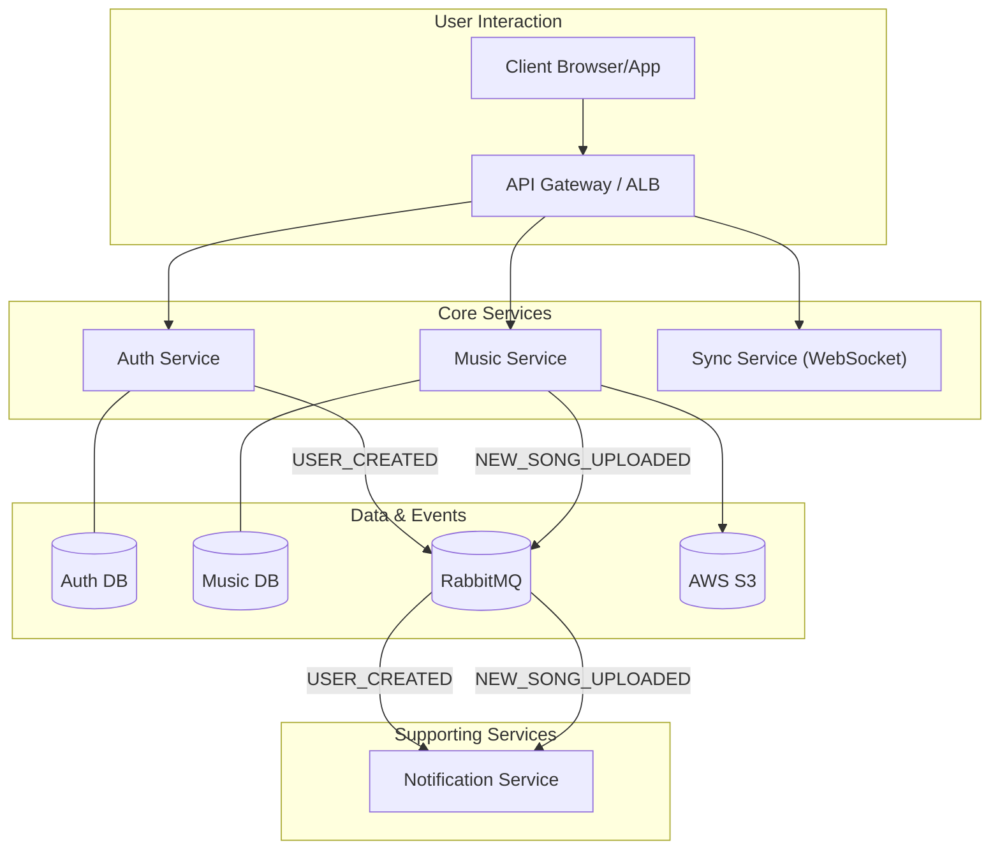
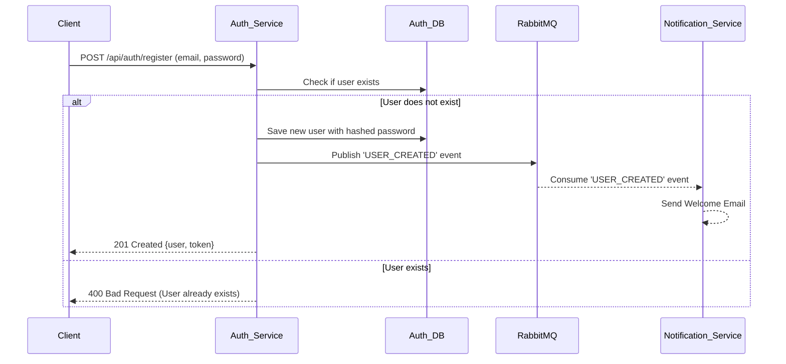
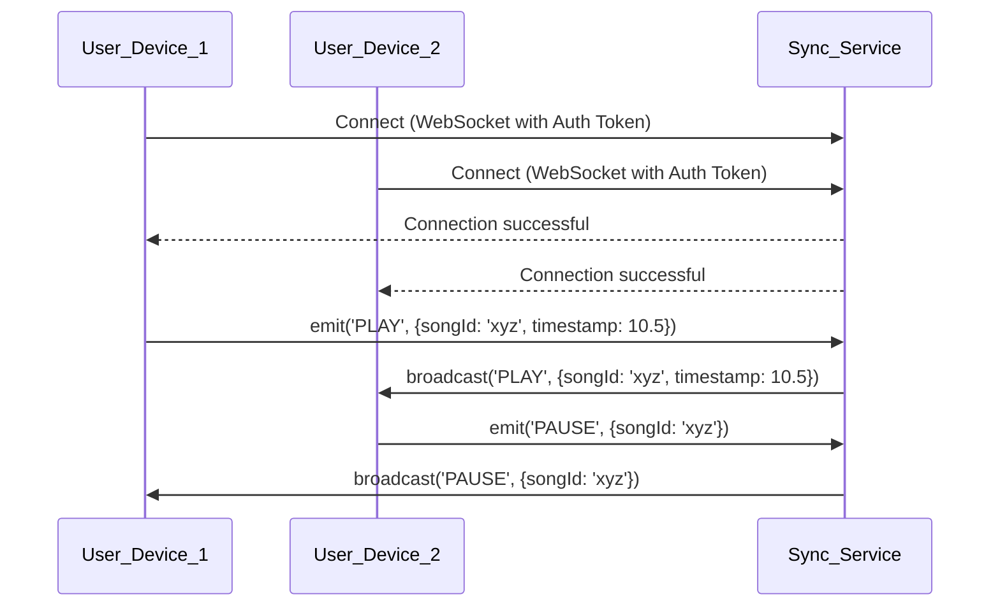

# 🎵 Sangeet: Your Microservices-Powered Music Application 🎵

Welcome to **Sangeet**! This project is an ambitious journey to build a scalable, resilient, and feature-rich music streaming platform, like Spotify, using a microservices architecture.

## ✨ The Sangeet Vision: Why Microservices?

Imagine a music app that can handle millions of users, where new features can be added without disrupting existing ones, and where a hiccup in one area doesn't bring down the entire platform. That's the power of microservices, and that's the vision for Sangeet!

We're breaking down the traditional monolithic application into smaller, manageable, and independently deployable services. This approach brings a plethora of benefits:

-   **Scalability:** Each service (authentication, music streaming, notifications) can be scaled independently based on its demand.
-   **Resilience:** A failure in one service won't cascade and affect the entire application.
-   **Agility:** Faster development cycles and easier deployment of new features.
-   **Technology Diversity:** Freedom to choose the best technology stack for each service.

## 🗺️ Architectural Blueprint: How It All Connects

Sangeet is designed as a constellation of specialized services, each handling a distinct domain of the music ecosystem.

-   **Asynchronous Communication with RabbitMQ:** To ensure seamless and fault-tolerant communication, we use **RabbitMQ** as a message broker. This acts as the central nervous system, allowing services to communicate asynchronously. For example, when a user registers, the `Auth Service` publishes a `USER_CREATED` event, and the `Notification Service` consumes this event to send a welcome email, all without the services being directly dependent on each other.
-   **AWS Cloud Hosting:** Each microservice is designed to be deployed independently on **Amazon Web Services (AWS)**, leveraging services like ECS for container orchestration and S3 for music file storage.

## ☁️ AWS Deployment

**Disclaimer:** The original AWS deployment for this project has been shut down due to the high costs associated with maintaining the infrastructure. The following is a general guide on how you can deploy the Sangeet services to your own AWS account.

The containerized nature of the Sangeet services makes them ideal for deployment to AWS. Here's a general guide to deploying the services using Amazon ECS:

1.  **Prerequisites:**
    -   An AWS account.
    -   AWS CLI installed and configured on your local machine.
    -   Docker installed on your local machine.

2.  **Create an ECR Repository for Each Service:**
    For each microservice, create a new private repository in Amazon Elastic Container Registry (ECR).

3.  **Build and Push Docker Images:**
    For each service, navigate to its directory, build the Docker image, and push it to its ECR repository.

4.  **Set up an ECS Cluster:**
    Create a new ECS cluster to run your containers. You can choose between the Fargate (serverless) or EC2 launch types.

5.  **Create Task Definitions:**
    For each service, create a new task definition in ECS. In the task definition, you will specify the Docker image, CPU/memory resources, port mappings, and the necessary environment variables.

6.  **Create Services:**
    For each task definition, create a new service in your ECS cluster to run and maintain your tasks.

7.  **Set up an Application Load Balancer (ALB):**
    Create an ALB to route incoming traffic to your services based on path rules (e.g., `/api/auth/*` goes to the auth service).

8.  **Configure Security Groups:**
    Ensure your security groups are configured correctly to allow traffic between the ALB, the ECS tasks, and other AWS resources.

## 📊 Architecture and Flow Diagrams

### High-Level Architecture

### User Authentication Flow

### Real-time Music Sync Flow

## 🌟 Current Services Spotlight

### 🔐 Auth Service
-   **Description:** The gatekeeper of Sangeet. This service is responsible for user registration, login, and token validation. It ensures that only legitimate users can access protected resources.
-   **Key Technologies:** `Node.js`, `Express`, `MongoDB`, `JWT`, `bcryptjs`, `amqplib`.

#### API Endpoints

| Method | Endpoint             | Description          | Auth Required |
| :----- | :------------------- | :------------------- | :------------ |
| POST   | `/api/auth/register` | Register a new user  | No            |
| POST   | `/api/auth/login`    | Login a user         | No            |
| GET    | `/api/auth/me`       | Get current user     | Yes           |

### 🎵 Music Service (Placeholder)
-   **Description:** The heart of our catalog. This service will manage all music-related operations, including uploading, streaming, and retrieving song details. It will integrate with AWS S3 for file storage.
-   **Key Technologies:** `Node.js`, `Express`, `MongoDB`, `AWS-SDK`.

### 🔄 Sync Service (Placeholder)
-   **Description:** This service provides the real-time magic. Using WebSockets, it ensures that playback is synchronized across multiple devices logged in with the same user account, providing a seamless listening experience.
-   **Key Technologies:** `Node.js`, `Express`, `socket.io`.

### 🔔 Notification Service
-   **Description:** This service works behind the scenes to keep users informed. It listens for events (like `USER_CREATED`) from other services via RabbitMQ and sends out notifications.
-   **Key Technologies:** `Node.js`, `Express`, `amqplib`, `nodemailer`.
-   **Consumed Events:**
    -   `USER_CREATED`
    -   `NEW_SONG_UPLOADED`

### ⚛️ Frontend Service
-   **Description:** The user interface of Sangeet. This service is a single-page application (SPA) built with React that provides a rich and interactive user experience for interacting with the Sangeet platform.
-   **Key Technologies:** `React`, `Vite`, `React Router`, `axios`.

